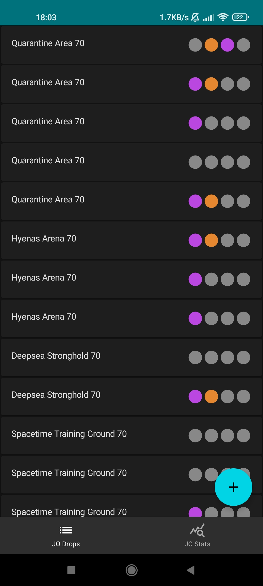
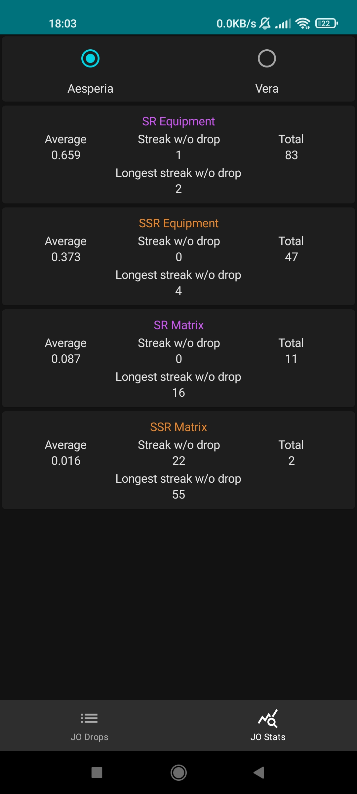
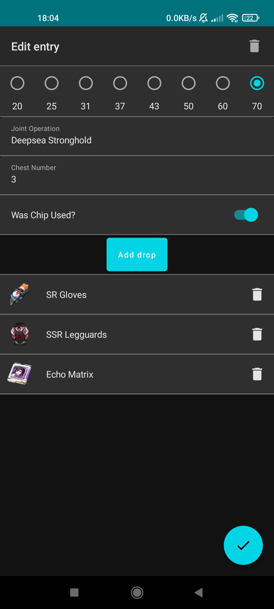

# Tower of Fantasy Assistant

  
  
  

Up until Tower of Fantasy 2.3 this app made it easier to gather data about drops from Joint Operations and calculate crit rate.
In version 2.4 crit rate calculations became pointless and in 2.5 gathering data about JO drops became pointless as well.
In its current state this app is outdated and thus useless.
While code quality is not perfect and could be definitely improved in many places I'm quite happy with how this app turned out.
